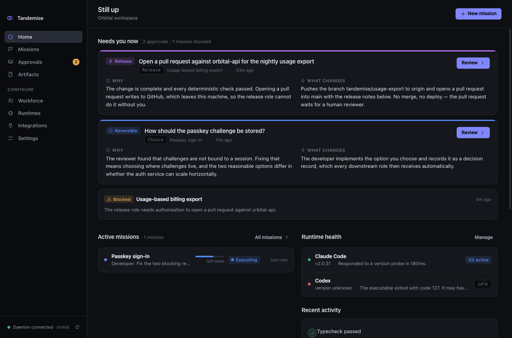
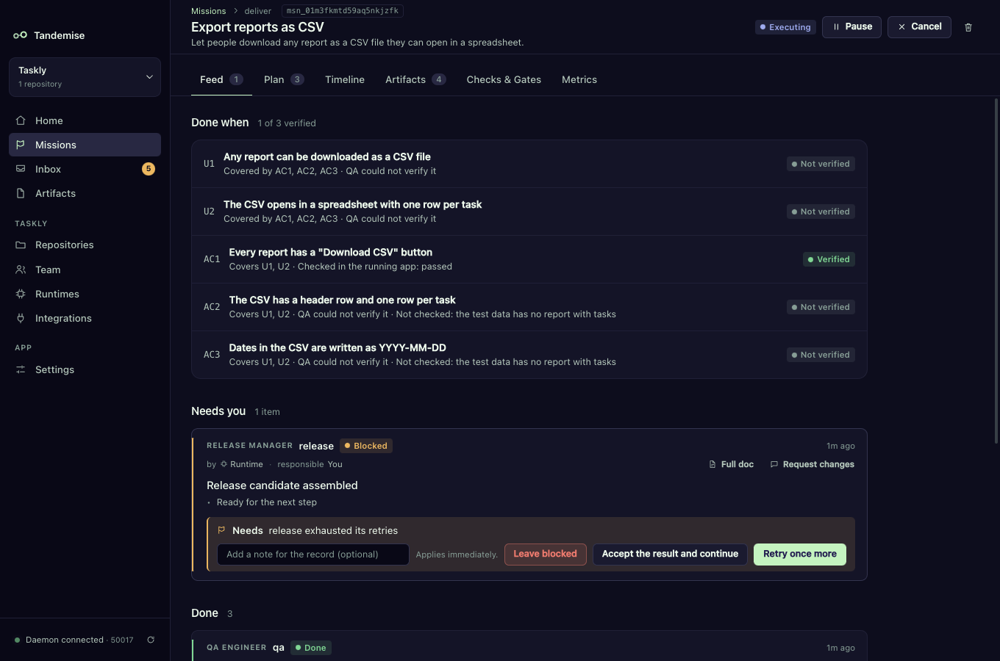
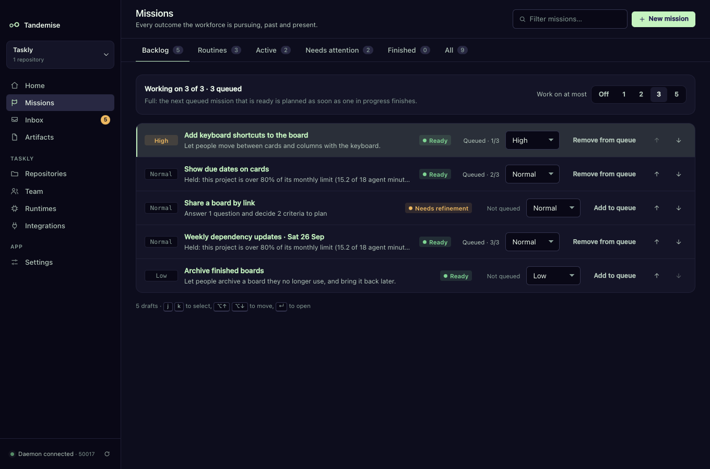
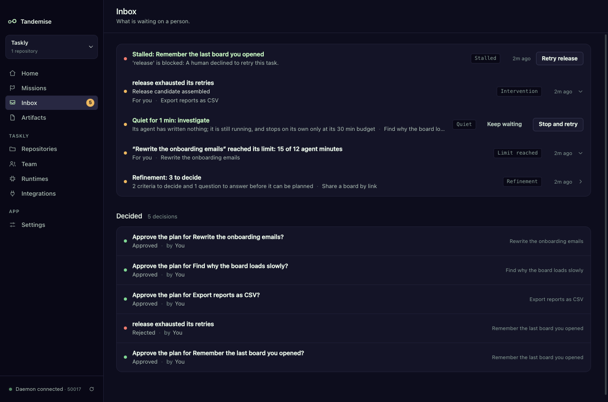
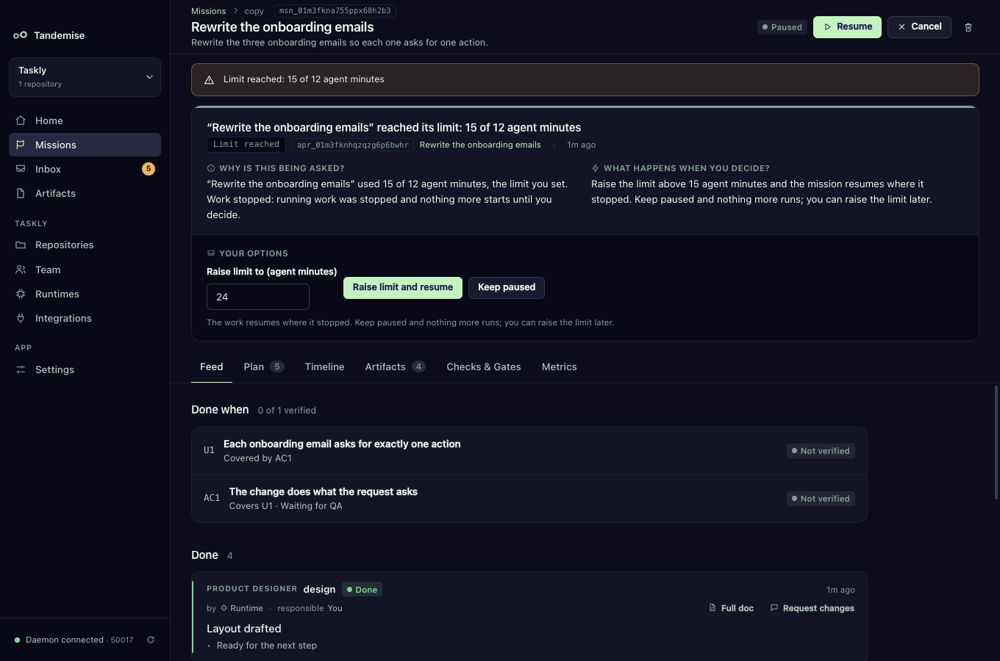

# Tandemise

[](https://github.com/demogar/tandemise/actions/workflows/ci.yml)
[](LICENSE)

*A local-first operating system for running a software company with
interchangeable AI workers, tools, and machines.*

Tandemise is not a model, a coding agent, or a chat client. It is the
organization layer above them. It owns the missions, roles, state, permissions,
artifacts, approvals, evaluation, and recovery — and delegates the actual work to
whichever agent runtimes, integrations, and machines you choose.

> **The architectural maxim.** Tandemise owns the organization. Agents are
> replaceable workers. Tools are replaceable capabilities. Machines are
> replaceable execution targets.

The test this codebase is built to pass: *if Claude Code disappeared tomorrow,
the organization should survive.* Missions, roles, decisions, artifacts,
permissions and history stay intact. Only an adapter changes.

---

## How it works

You give Tandemise an outcome in one sentence and say what "done" means. It
plans a DAG of tasks across specialized roles, runs each one in an isolated Git
worktree through whichever runtime you've routed that role to, collects typed
artifacts at every stage, measures deterministic gates, escalates to you only
for decisions that deserve human judgement, and ends at a verified release
candidate.

```
Intent → Plan → Approve → Execute → Review → QA → Release candidate → Your call
```



Around that engine sits the loop a product owner runs every day, with you as
the owner and your agents as the team:

```
Request → Refine → Done when → Backlog + WIP limit → Run within limits
        → Verify per criterion → Inbox for anything stuck → Desk + status report
        → Routines bring the next request
```

1. **Request.** One sentence on **New mission**.
2. **Refine.** If you have not said what done means, a product agent proposes
   criteria and asks only the questions that change the plan. You accept,
   edit or reject each one. → [Refine a rough request](docs/guides/refine.md)
3. **Done when.** Every line becomes a numbered criterion (`U1`, `U2`, …). A
   mission cannot be planned without one. → [Done when](docs/guides/done-when.md)
4. **Backlog and WIP.** Rank requests by priority, queue them, and set how many
   missions run at once. When a slot frees up, the next ready one is planned.
   → [Backlog and work in progress](docs/guides/backlog.md)
5. **Run within limits.** Agent minutes, tokens or dollars per mission and per
   month. At the limit work stops and one card asks you to raise it or keep it
   paused. → [Limits](docs/guides/limits.md)
6. **Verify per criterion.** The spec must cover every line, QA must verify
   every criterion by id, and the release gate will not pass while one is
   unverified. The mission shows it as a checklist.
7. **Inbox for anything stuck.** A mission nothing moves and nothing asks
   about gets one **Stalled** row with the one action that moves it; an agent
   that goes quiet gets a **Quiet** row. → [The Inbox](docs/guides/inbox.md)
8. **Desk and status report.** Home counts what needs you, what is in
   progress, what is verified, what it cost and what is stuck. **Status
   report** writes the same picture from stored facts, no model involved.
   → [The desk](docs/guides/desk-and-status-report.md)
9. **Routines.** Standing work (weekly dependency updates, nightly check
   fixes, a Friday report) is added to the backlog on schedule, ready to plan.
   → [Routines](docs/guides/routines.md)

Every step is decided by the daemon from stored facts and fixed rules; no model
output decides whether work is done, planned, stopped or stuck. Nothing gets
copy-pasted between tools. Everything is attributable and recoverable.

<table>
  <tr>
    <td></td>
    <td></td>
  </tr>
  <tr>
    <td></td>
    <td></td>
  </tr>
</table>

Each step can run on the model that fits it, retry on a stronger one and drop to a
cheaper one near a limit — see [Choosing models](docs/guides/models.md).

When something needs you and the window is in the background, a native
notification says so once, never a flood, and opens the decision when clicked.
See [Notifications](docs/guides/notifications.md) for the switches and quiet
hours.

Bring the skills you already use (`~/.claude/skills`, a folder, a git repository)
and pin them to the roles that need them; every run gets exactly the version it
was pinned to — see [Giving your agents your skills](docs/guides/skills.md).

Label a GitHub issue `tandemise` and it becomes a draft mission (queued when it
says what "done" means); when the work ships, the issue gets the criteria table
and, if you want, is closed — see [GitHub issues in and out](docs/guides/github-issues.md).

## Architecture

```
┌──────────────────────────────────────────────────────────────┐
│  apps/desktop        Electron + React. Control surface only.  │
│                      No filesystem, shell, or DB access.      │
└───────────────────────────┬──────────────────────────────────┘
                            │  HTTP + WebSocket on 127.0.0.1,
                            │  bearer-authenticated
┌───────────────────────────▼──────────────────────────────────┐
│  apps/daemon (tandemd)    The authoritative process.          │
│                           Composition root — the ONLY place   │
│                           that names a concrete provider.     │
└───────────────────────────┬──────────────────────────────────┘
                            │
┌───────────────────────────▼──────────────────────────────────┐
│  packages/application     Mission engine: planning, DAG       │
│                           scheduling, gates, recovery.        │
│                           Depends on ports, never providers.  │
├──────────────────────────────────────────────────────────────┤
│  packages/domain          Entities, the canonical agent event │
│  packages/kernel          vocabulary, the gate language, DAG  │
│  packages/shared          validation, and every port.         │
├──────────────────────────────────────────────────────────────┤
│  Providers (outward)                                          │
│    runtime-claude · runtime-generic · runtime-codex           │
│    execution-local · persistence · artifacts                  │
│    integration-github · browser · desktop-control             │
└──────────────────────────────────────────────────────────────┘
```

**The dependency rule is enforced mechanically.** `npm run check:boundaries`
fails the build if a package imports something it hasn't declared, imports from
an equal-or-higher layer, or — if it's a core package — imports a provider
module like `electron`, `playwright`, `better-sqlite3`, or `child_process`.

### Why it's shaped this way

- **Adapters, not integrations.** Every runtime implements one contract and
  contributes itself to a registry. Routing is by *capability* — the scheduler
  asks "who can do `shell` + `git`, is healthy, and isn't saturated?", never
  "is Claude available?". Adding a new worker is: write the adapter, export a
  module, append it to the composition list.
- **Artifacts, not chat.** Roles hand off typed documents with schemas —
  ProductSpec, ArchitecturePlan, ChangeSet, ReviewReport, QAReport — written to
  `.tandemise/out/` and validated on collection. A reviewer reads the diff and
  the spec, never the implementer's transcript, because independence is the
  whole point of a review.
- **Gates, not assurances.** Progression depends on measured facts:
  `checks.typecheck == PASS && review.blocking_findings == 0`. "The developer
  says it's done" is never a gate condition. When a gate blocks, it tells you
  exactly which conjunct failed and what the measured value was.
- **Default deny.** No tool, path, domain, or app is reachable without an
  explicit grant scoped to one worker assignment. A QA worker cannot even
  *discover* a production-write tool.
- **Crash recovery is a feature.** The daemon outlives the window. Runs are
  checkpointed with resumable session handles; a restart reconciles interrupted
  runs, releases only leases whose holder is genuinely dead, and tells you in the
  mission timeline that it happened.

## Getting started

Requires **Node 22** and macOS.

```bash
nvm use                 # 22.23.1, per .nvmrc
npm install
npm run build
npm run check:boundaries

npm run daemon          # starts tandemd
npm run desktop         # starts the Electron app
```

Point it at a Git repository, connect a runtime (Claude Code is detected
automatically; any other CLI can be wired through the generic adapter without
writing code), and create a mission. [docs/QUICKSTART.md](docs/QUICKSTART.md)
walks through the first one.

## Guides

Task-oriented, one per concept:

| Guide | How do I… |
|---|---|
| [Done when](docs/guides/done-when.md) | say what finished means and see each criterion verified |
| [Refine a rough request](docs/guides/refine.md) | turn a one-liner into something ready to plan |
| [Backlog and work in progress](docs/guides/backlog.md) | rank requests and limit how many run at once |
| [Limits](docs/guides/limits.md) | cap agent minutes, tokens or dollars per mission and per month |
| [The Inbox](docs/guides/inbox.md) | find stalled missions and quiet agents, and unstick them |
| [The desk and the status report](docs/guides/desk-and-status-report.md) | read Home at a glance and write a report from facts |
| [Routines](docs/guides/routines.md) | put standing work on a schedule |
| [Notifications](docs/guides/notifications.md) | hear about new Inbox items while the window is in the background |
| [About and diagnostics](docs/guides/about-and-diagnostics.md) | see which app and daemon build is running, and copy diagnostics for a bug report |
| [Giving your agents your skills](docs/guides/skills.md) | import the skills I already use and pin them to roles and steps |
| [GitHub issues in and out](docs/guides/github-issues.md) | turn labelled issues into missions and report back on them |
| [Workflows](docs/WORKFLOWS.md) | write my own process as a file, and see which gate facts exist |

## Repository layout

| Path | What lives there |
|---|---|
| `packages/shared` | Branded ids, errors, `Result`, clock, structured logging, secret redaction, path scoping |
| `packages/kernel` | Typed service tokens, the IoC container, composable modules, the capability registry |
| `packages/domain` | Entities, event vocabulary, gate language, plan validation, **all ports** |
| `packages/application` | Mission engine — planning, scheduling, execution, gates, remediation, recovery |
| `packages/policy` | Risk classification, permission decisions, grant derivation, trust boundaries |
| `packages/persistence` | SQLite (WAL) implementations of the repository ports, plus migrations |
| `packages/artifacts` | Content-addressed artifact store and the artifact schemas |
| `packages/context` | The context compiler — smallest task-relevant prompt bundle |
| `packages/evaluation` | Deterministic checks and the gate fact vocabulary |
| `packages/runtimes-core` | The `AgentRuntimeAdapter` contract, registry, and capability router |
| `packages/execution-core` | Execution target contract, process supervisor, scoped filesystem |
| `packages/integrations-core` | Tool broker, run-scoped tool gateway, MCP gateway |
| `apps/daemon` | `tandemd` — HTTP/WS API, composition root, lifecycle |
| `apps/desktop` | Electron main/preload + React renderer |
| `native/macos-helper` | Swift helper for Accessibility, screen capture, and input |
| `docs/` | `guides/` (how to use each feature), `QUICKSTART.md`, `WORKFLOWS.md` (workflow files and gate facts), `BUILD_BRIEF.md` (engineering contract), `APPLICATION_DESIGN.md` (mission engine), `DESIGN_SYSTEM.md` (palette, tokens, logo) |
| `apps/desktop/screenshots/` | Screenshots of the desktop app, used by this README and the guides |

`MVP.md` is the full product and architecture specification this implements.

## Origins

Tandemise started as a private tool built for one job: helping me build
[Beveloce](https://beveloce.com), an AI cycling coach, with a team of agents
instead of a single chat window. Once it was running real missions every day, I
cleaned it up, took out everything specific to that one product, and released
it as open source so any developer can use it, extend it, and plug in their own
agents, tools, and machines.

## Inspiration

Tandemise is heavily inspired by a handful of projects that are working out how
people and agents get real work done together, and most of its shape is
borrowed from them rather than invented here:

- **The phases.** The names and order of the stages a mission moves through
  (Intent → Plan → Approve → Execute → Review → QA → Release candidate → Your
  call) and of the owner's loop around it (request, refine, done when, backlog,
  limits, verify, inbox, desk, routines).
- **The distribution of work.** How work is split across specialized roles
  (product, design, architecture, developer, reviewer, QA, release), how it is
  shared between people and agents, and who is responsible for what.
- **The operating model.** Budgets and limits, approvals that only ask for real
  decisions, standing work on a schedule, and agents as members of a team
  rather than tools you chat with.

What Tandemise adds is mostly the assembly: putting these ideas together in one
local-first place, with typed artifacts and gates measured from facts.

- **[Grok Bot](https://x.ai/bot)** treats agents as persistent teammates that
  keep working on their own and come back only when something needs your
  approval. Tandemise's approvals, its inbox, and its routines that queue
  standing work on a schedule follow that model.
- **[Paperclip](https://github.com/paperclipai/paperclip)** showed that the
  interesting layer sits above the agents: an organization with roles, goals,
  budgets, and governance that runs whatever agents you already have. The
  organization layer, the roles, and the spend and time limits come from there.
- **[Buzz](https://buzz.xyz)** puts people and agents in the same workspace as
  equals, next to the code, without locking you into one vendor's models.
  Tandemise borrows its owned-agent model (every agent has a person who owns it
  and answers for its work) and owner-reviewed drafts, along with human steps in
  workflows and runtimes as replaceable adapters.
- **[Hermes Agent](https://github.com/NousResearch/hermes-agent)** is an agent
  that grows with you: it builds skills from experience and remembers what it
  has done. The idea that missions, decisions, and history should outlive any
  single agent or session comes from there.

Thank you to the people behind each of them.

## Contributing

Contributions are welcome. Read [CONTRIBUTING.md](CONTRIBUTING.md) for the
workflow (Conventional Commit PR titles, squash merges, automated releases) and
[SECURITY.md](SECURITY.md) for reporting vulnerabilities.

## License

Tandemise is licensed under the [Apache License 2.0](LICENSE).
