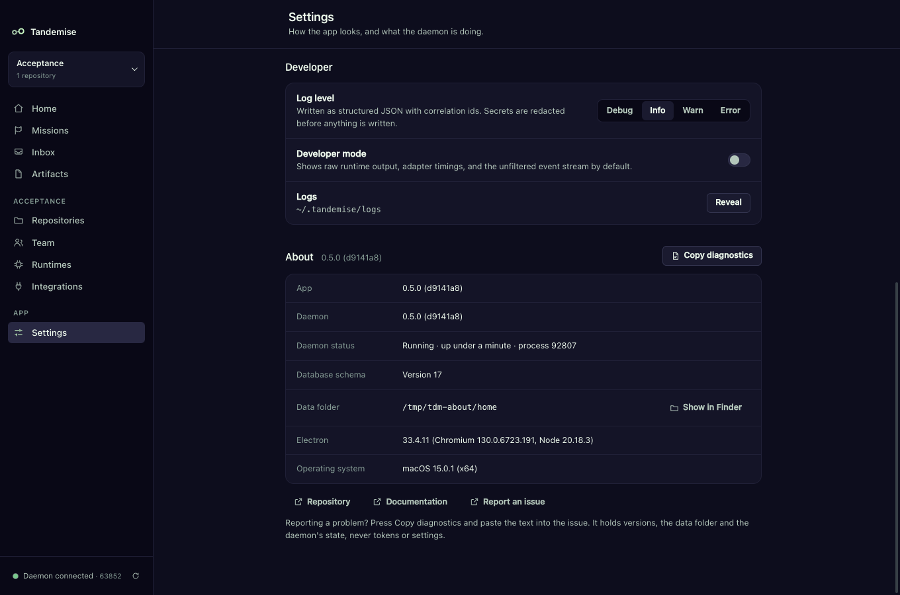

# About and diagnostics: which code is running

Tandemise is two programs: the desktop app you click in, and the daemon that
does the work and keeps your data. When something looks wrong, the first
question is usually "are both of them the code I think they are?". **Settings →
About** answers it, and **Copy diagnostics** puts the answer on your clipboard
for a bug report.



## What does it show?

Open **Settings** and scroll to **About** at the bottom.

| Row | What it tells you |
|---|---|
| **App** | The desktop app's version and the git commit it was built from, e.g. `0.5.0 (92f0f03)`. `dev build` means the commit was not known when it was built. |
| **Daemon** | The same for the daemon you are connected to. |
| **Daemon status** | `Running`, how long it has been up, and its process id. |
| **Database schema** | The number of the last database migration the daemon applied. |
| **Data folder** | Where your missions, logs and settings live (`~/.tandemise` unless `TANDEMISE_HOME` says otherwise). **Show in Finder** opens it. |
| **Electron** | The Electron, Chromium and Node versions inside the app. |
| **Operating system** | Your macOS version and processor architecture. |

Below the table: **Repository**, **Documentation** and **Report an issue**
open the project on GitHub. The **Help** menu has **Documentation** and
**Report an Issue** too.

## The app and the daemon disagree. What do I do?

If the two came from different code, About shows a warning above the table
and says exactly what to do:

- **Different versions** ("The app is 0.5.0 but the daemon is 0.4.0"): restart
  the daemon. In a terminal, run `kill <process id>` (the warning names it),
  then `npm run daemon` in the repository. The window reconnects by itself
  within a few seconds and the warning goes away.
- **Same version, different commits** ("built from commit 92f0f03 but the
  daemon from 1a2b3c4"): the daemon is still running an older build of your
  checkout. Run `npm run build`, then restart the daemon the same way.

If you use your own data folder, start the daemon with the same
`TANDEMISE_HOME` the app uses.

Your data stays where it is. On start the daemon reconciles whatever was
running when it stopped; a run that was cut off is retried (see
[Known limitations](../KNOWN_LIMITATIONS.md) for the few things a restart ends).

## How do I report a problem?

1. **Settings → About → Copy diagnostics.** The button says **Copied**.
2. **Report an issue** (in About, or **Help → Report an Issue**) opens a new
   bug report on GitHub.
3. Paste the diagnostics into the report, next to what you did and what
   happened.

The copied text is plain, one fact per line:

```
Tandemise diagnostics
Generated: 2026-09-26T22:14:03.120Z

App
  Version: 0.5.0 (92f0f03)
  Electron: 33.4.11
  Chromium: 130.0.6723.191
  Node (app): 20.18.3
  OS: macOS 15.0.1 (x64)

Daemon
  Status: Running
  Version: 0.5.0 (92f0f03)
  API: v1
  Database schema: 16
  Uptime: 3h 12m (since 2026-09-26T19:02:11.004Z)
  Process id: 4242
  Node (daemon): v22.23.1
  Platform: darwin-x64
  Data folder: ~/.tandemise

Mismatch: none
```

It never contains the daemon's access token, API keys, your settings or your
environment: it is built from the named facts above and nothing else. Your
home folder is written as `~`. Read it before you paste it anyway; it is your
report.

## Where do the versions come from?

- **Version**: the release version (`apps/desktop/package.json` for the app,
  the daemon's own release version for the daemon). Releases bump both
  together.
- **Commit**: the short git commit at build time. The app records it when
  `electron-vite` builds or starts it; the daemon records it at `npm run build`
  (`apps/daemon/dist/build-info.json`). Without git (a source tarball) both say
  `dev build`.

The native **About Tandemise** panel (app menu) shows the same version and
commit, `Version 0.5.0 (92f0f03)`, with the copyright, the Apache-2.0 license
and a link to the repository.
