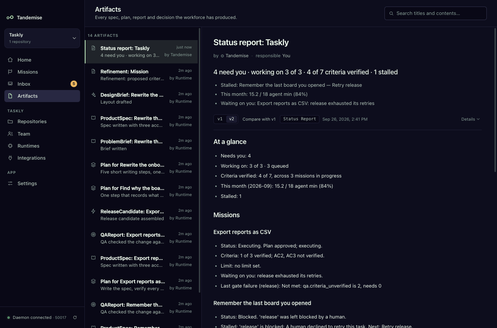

# The desk and the status report

Home is your desk. Five numbers answer the morning questions: what needs me,
what is moving, how much of "done" is verified, what it has cost, and what is
stuck. The **Status report** button writes the same picture down as a document,
from stored facts, with no model involved.

## What do the five cards mean?

Each card is a link to the list behind its number.

| Card | Shows | Opens |
|---|---|---|
| **Needs you** | requests waiting on you: cards, steps for you, drafts to refine, quiet agents | the Inbox |
| **Working on** | missions in progress against your limit ("3 of 3"), and how many are queued | Missions, filtered to the missions in progress |
| **Criteria verified** | Done-when criteria QA verified, summed over the missions in progress ("4 of 7") | the same filtered list; each row shows its own "1 of 3 verified" |
| **This month** | the share of the project's monthly limit used ("84%", "15.2 / 18 agent min") | Repositories → Limits |
| **Stalled** | missions nothing moves and nothing asks you about | the Inbox, stalled missions only |

**Needs you** and **Stalled** never count the same thing: "Needs you 4 ·
Stalled 1" means five things to look at. (Needs you now, below the cards, lists
both, because both need you.)

"In progress" means started and not finished, blocked missions included; drafts
and paused missions are not counted. It is the same rule the
[backlog](backlog.md) uses for its limit.

## What do the banners mean?

Under the cards, a banner appears only when it is true:

- **"Monthly limit at 84% — only urgent and high work will be pulled."** The
  project is over the warning level of its monthly limit. **See limit** opens
  Repositories → Limits. (See [Limits](limits.md).)
- **"Working on 3 of 3 — 3 queued missions wait for a free slot."** Every slot
  is full and work is queued behind it. **See backlog** opens the Backlog tab.

A mission at or over its own limit gets its own banner, with **Decide**.

## How do I write a status report?

Press **Status report** at the top of Home. It shows "Writing…" and then opens
the report in the artifact reader.

The report has:

- **At a glance**: the five desk numbers.
- **Missions**: each mission in progress, in backlog order, with its status,
  whether it is moving, waiting on you or stalled (and the one action), its
  criteria ("1 of 3 verified; AC2, AC3 not verified"), its limit, what waits on
  you, and its last gate failure quoted exactly as it was shown
  ("Not met: qa.criteria_unverified is 2, needs 0").
- **Backlog**: queued drafts in the order they will be picked, with priority,
  readiness and any "Held: …", then drafts not queued.
- **How this report was made**: which records it was read from.

## Can I trust it?

The report is rendered by a fixed template over stored rows: mission and step
records, the Done-when ledger and the newest QA report, usage records, open
cards and the event log. No model writes any of it, so it cannot claim progress
that did not happen. The same facts always give the same report, byte for byte.
The time it was written is kept in the report's header, never in its body.

Each report is a new version of the same document. Use **v1 / v2** and **Compare
with v1** in the reader to see what changed since the last one. Reports appear
under **Artifacts** like any other document.

## Can it be written on a schedule?

Yes: make a **Weekly status report** routine (see [Routines](routines.md)).
