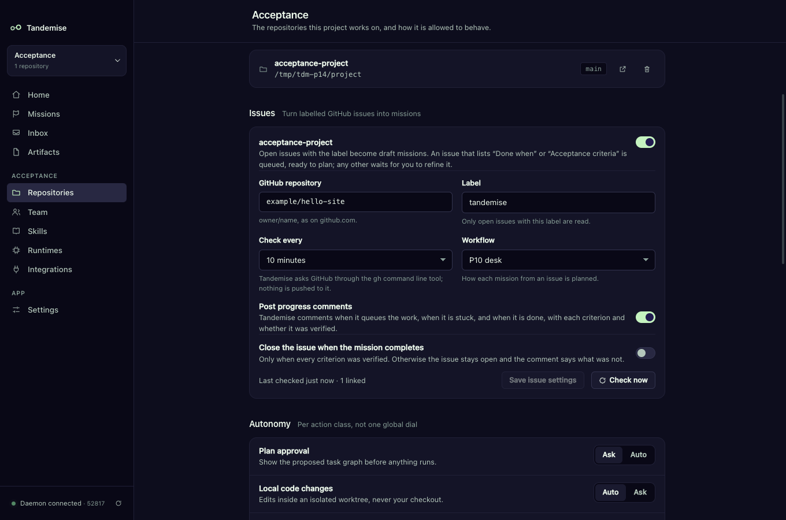
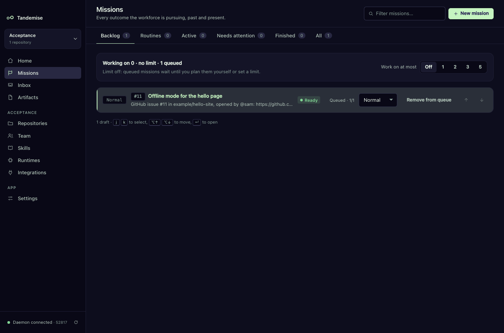
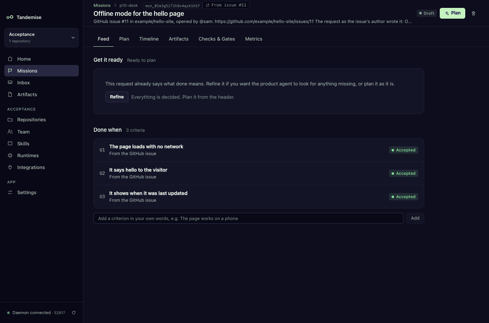

# GitHub issues in and out

Your backlog may already live in GitHub issues: the ones contributors file and
the ones you file for yourself. Tandemise can read them for you. Label an issue
`tandemise` and it becomes a draft mission on the next check. When the work is
done, Tandemise comments on the issue with each criterion and whether it was
verified, and can close the issue for you. Nothing is copied by hand.

It works through the `gh` command-line tool you already signed in to. Tandemise
stores no GitHub token, needs no webhook and runs no server: it asks GitHub on a
timer, from your machine.

## How do I turn it on?

1. Make sure `gh` is installed and signed in: `gh auth status`.
2. Open **Repositories** (in the sidebar, under your project's name) and scroll
   to **Issues**. Each repository of the project has its own card.
3. Check **GitHub repository**. It is filled in from the checkout's remote when
   that points at GitHub; otherwise type it as `owner/name`.
4. Pick a **Workflow** if missions from issues should be planned a particular
   way. By default they use the project's own.
5. Switch on **Turn labelled issues into missions**.

Tandemise checks straight away, then every 10 minutes (**Check every** changes
that). **Check now** checks at once. The line under the card says when it last
checked and how many issues it has linked: "Last checked 2 min ago · 3 linked".



Only open issues that carry the **Label** (`tandemise` unless you change it)
are read, the newest 100 per check. Two repositories of one project cannot read
the same GitHub repository.

## What does an issue become?

A draft mission in **Missions → Backlog**, with a **#12** chip that opens the
issue in your browser:

- **Title**: the issue's title.
- **Goal**: the issue as written, starting with "GitHub issue #12 in
  owner/name, opened by @sam". The planner and the agents read it as the
  request, attributed to the person who filed it.
- **Done when**: if the issue has a section headed **Done when** or
  **Acceptance criteria**, its lines become the mission's criteria, U1, U2 and
  so on. The draft is then **queued**, ready to plan when it reaches the front
  of the backlog.
- If it has no such section, the draft is **not queued** and shows **Needs
  refinement**. Open it, refine it or add Done-when lines yourself, then
  **Add to queue**.



The mission's header says **From issue #11**; click it to open the issue.



### How should I write "Done when" in an issue?

Any of these work:

```markdown
## Done when
- [ ] The page loads with no network
- [ ] It says hello to the visitor
```

```markdown
**Acceptance criteria**
1. Colours follow the system setting
2. Contrast passes
```

```markdown
Done when: the export finishes in under a minute
```

Checklist items win over plain list items; without a list, each paragraph under
the heading is one criterion. A ticked box counts the same as an empty one
(ticking it on GitHub verifies nothing). A checklist anywhere else in the issue
is treated as a to-do list, not as criteria. At most 20 lines are read.

## What does Tandemise write back?

With **Post progress comments** on (the default), at most one comment of each
kind, updated in place rather than repeated:

| When | The comment starts with |
|---|---|
| the draft is queued | "Queued in Tandemise — 3 criteria." and the list |
| the mission is stuck (a **Stalled** row in your Inbox) | "Tandemise is stuck on this: …" and the next step; once per stall |
| the mission is complete | "Done in Tandemise — 3 of 3 criteria verified." with a table of each criterion (Verified, Failed, Skipped or Not verified) and links to the pull request or branch if the agents shared one |

Text copied from the issue is escaped and never @mentions anyone.

## Can it close the issue?

Only if you switch on **Close the issue when the mission completes**, and only
when every criterion was verified. If one failed or was not verified, the
completion comment says "Left open: 1 criterion was not verified." and the issue
stays open.

## What if the issue changes on GitHub?

- **Edited before planning starts**: the draft's title, goal and the Done-when
  lines that came from the issue follow the edit. Lines you added yourself in
  Tandemise stay. A note on the mission's **Timeline** says so.
- **Edited after planning started**: the mission keeps its plan; the Timeline
  gets a note so you can read the change on GitHub.
- **Closed**: a draft is taken off the queue with a note ("Issue #13 was closed
  upstream, so this draft was taken off the queue."). It is not deleted. A
  mission already under way carries on, with a note; cancel it if the work is no
  longer wanted.
- **Reopened**: a note; it is not queued again automatically.
- **Label removed**: the issue is simply no longer watched.

Deleting a draft that came from an issue is how you say "not this one": the
issue does not come back on the next check.

## Is it safe to let anyone file issues?

The issue's text is only ever the request. It cannot change a setting, a label,
which issues are read, a mission's priority or its limits, and it cannot skip a
gate: a draft from an issue is planned only when it is ready and there is room,
exactly like one you typed. What its agents may do is still decided by your
autonomy settings and roles.

If you would rather decide first, leave the label to yourself: only issues you
(or someone with triage rights) label are read.

## When something goes wrong

The card shows the last error under the status line, for example "Could not
check issues: The GitHub CLI is not authenticated. Run `gh auth login`." Fix it
and press **Check now**. A comment that could not be written is retried a
minute later.
