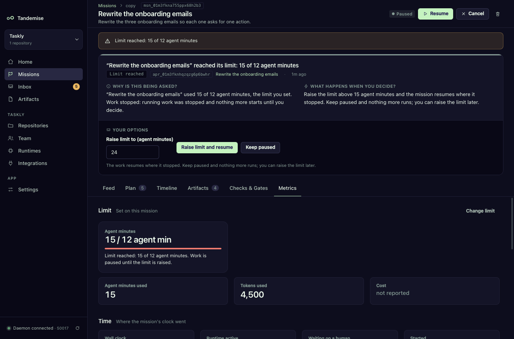

# Set spend and time limits

Give a mission, and the whole project per month, a ceiling on agent minutes,
tokens or US dollars. Tandemise measures what the runs recorded, warns you
before the ceiling, and stops work at it until you decide. Nothing an agent
says moves a limit.

## How do I set a limit on one mission?

- **When creating it**: **New mission → More options → Limit**. Fill in
  **Agent minutes for this mission**, **Tokens for this mission** or
  **Cost (USD) for this mission**, and optionally **Warn at (%)** (80 by
  default). Blank uses the project's defaults.
- **Later**: open the mission, **Metrics** tab, **Limit** section, **Set a
  limit** or **Change limit**. **Use the project default** goes back to the
  project's setting.

## How do I set a monthly limit for the project?

**Repositories → Limits**. It shows this month's usage and two editors:

- **Per month, for the whole project**: **Save monthly limit**.
- **Per mission, unless a mission sets its own**: the default for every mission
  without its own limit. **Save mission limit**.

The month is the calendar month in the daemon's local time.

## What happens as usage grows?

| Level | When | What happens |
|---|---|---|
| OK | below the warning level | nothing |
| Warning | at or over the warning level | a timeline note with the numbers ("Limit warning: 10 of 12 agent minutes used (83%). Work stops at 12 agent minutes."), a banner on Home. Over the **monthly** warning level only Urgent and High missions are picked from the backlog |
| Limit reached | at or over 100% | work stops (below) |

## What does "work stops" mean?

- The mission is paused with the reason, for example "Limit reached: 15 of 12
  agent minutes". A monthly limit pauses every working mission in the project.
- Steps that were running are stopped and go back to ready, so they run again
  when the mission resumes. Nothing downstream is lost.
- One card asks you what to do. It appears on the mission page, in the Inbox
  ("Limit reached") and on Home.
- **Resume** in the header is refused while the limit holds, with the reason.

## How do I decide?

On the card:

- **Raise limit and resume**: type the new amount in **Raise limit to** (it is
  prefilled with a suggestion). It must be above both the old limit and what
  was already used, otherwise the card says so ("Raise it above 15 agent
  minutes: …"). The mission resumes where it stopped.
- **Keep paused**: the mission stays paused, with the reason "Kept paused at its
  limit: …". Raise the limit later (on the mission's Metrics tab or in
  Repositories → Limits) and it resumes.

Changing a limit in an editor is the same decision: raise it above what was used
and the paused work resumes; lower it below what was used and the work stops at
once.

## What is measured?

| Metric | From | When the runtime does not report it |
|---|---|---|
| Agent minutes | the runtime's own duration, or the run's duration by the daemon's clock | always measured |
| Tokens | input + output tokens the runtime reported | "not reported" |
| Cost (USD) | the cost the runtime reported | "not reported" |

"Not reported" is never read as zero. A USD limit on a runtime that reports no
cost (a subscription runtime, for example) can never stop work: the Metrics tab
says "Cost: not reported" and the timeline says so once. Use an agent-minutes
or tokens limit to cap that mission instead.

Planning and refinement runs are not counted.

## Can a gate read these numbers?

The daemon publishes them as facts (`mission.agent_minutes`,
`mission.limit_percent`, `workspace.month_limit_percent`, …), listed in
[WORKFLOWS.md](../WORKFLOWS.md#gate-facts). The stop itself is a daemon rule,
not a gate you write, and these facts are not measured inside a step's
completion gate.
