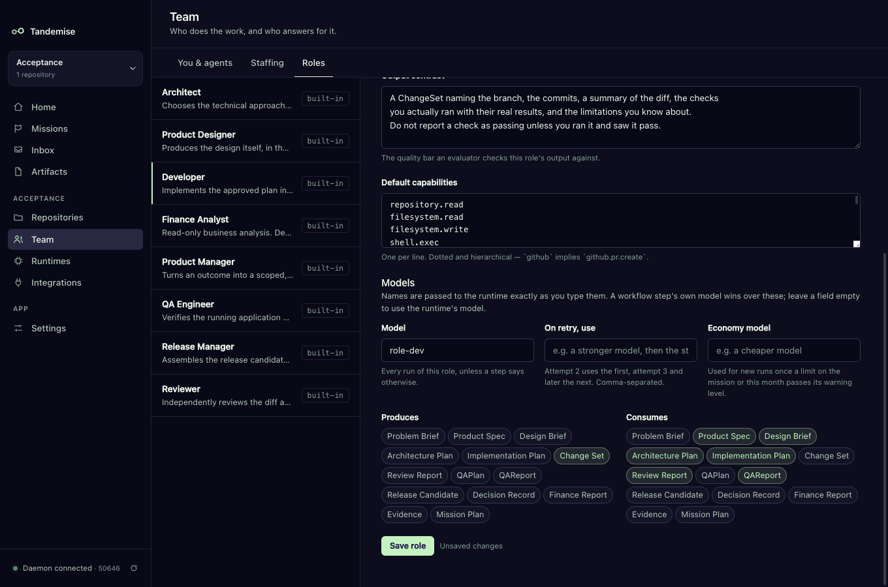
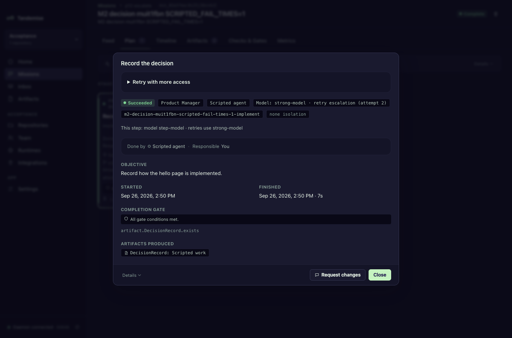
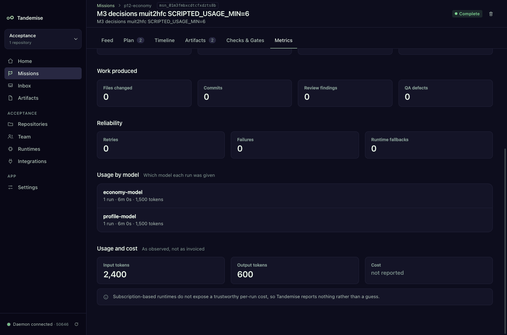

# Choosing models for your agents

Tandemise can give each step of a mission its own model: a cheap one for
routine work, a strong one where it matters, a stronger one when a step keeps
failing, a cheaper one when you are close to a spending limit, and a reviewer
that is not the model that wrote the code. It applies the same rule every time
and tells you which model each run used and why.

Model names are whatever your runtime understands — a short alias or a full
model id. Tandemise passes them through exactly as you type them; it keeps no
list of models of its own.

## Where a model can be set

| Where | How | Used for |
|---|---|---|
| Runtime profile | Runtimes → the profile's **Model** setting | the fallback for every run on that runtime |
| Role | Team → Roles → a role → **Models** | every run of that role |
| Workflow step | `model:` on a step in `.tandemise/workflows/*.yaml` | that step only |

A step's model wins over its role's, and a role's wins over the runtime
profile's. Leave a field empty to fall through to the next one.



## How do I use a stronger model when a step fails?

Give the step (or its role) a ladder. Attempt 2 uses the first model on it,
attempt 3 the second, and any later attempt stays on the last one.

```yaml
steps:
  - key: implement
    role: development
    objective: Build the change.
    model: my-fast-model
    escalate: [my-strong-model, my-strongest-model]
```

In Team → Roles the same thing is **On retry, use**, comma-separated. A step's
ladder wins over its role's. A retry you start by hand keeps counting attempts,
so it stays escalated.

## How do I spend less when I'm close to a limit?

Set the role's **Economy model**. Once the mission's limit, or the project's
monthly limit, passes its warning level (see Limits), new runs of that role use
the economy model. A retry escalation still wins over it: repeating a failure on
a cheaper model only spends the budget twice. At 100% of a limit nothing runs at
all, whatever the model.

## How do I make sure a review is independent?

Add `independentOf` to the review step, naming the step it reviews:

```yaml
  - key: review
    role: review
    dependsOn: [implement]
    independentOf: implement
    outputs: [ReviewReport]
    gate: artifact.ReviewReport.exists
```

Tandemise adds `review.independent` to the step's gate. It is true only when the
review ran on a different runtime, or on a different model it knows about, than
the step it reviews. If either run used the runtime's own default model on the
same runtime, Tandemise cannot show they differ, so the gate fails. To fix it,
give the Reviewer role (or the step) a different model and click **Retry task**.

## Where do I see which model ran?

- **The step drawer** (click a step in the Plan tab) shows the latest run's
  model and why: "Model: my-strong-model · retry escalation (attempt 2)",
  "Model: my-cheap-model · economy: 85% of limit", "Model: runtime default".
  Below it, the step's own settings from the workflow file.
- **Mission → Metrics → Usage by model** lists each model with its runs, agent
  time, tokens and cost (when the runtime reports them).





## The rule, in order

The first line that applies decides:

1. The runtime cannot be given a model → **runtime default** (nothing is passed).
2. Attempt 2 or later and a ladder exists → **retry escalation (attempt N)**.
3. A limit is past its warning level and the role has an economy model → **economy: N% of limit**.
4. The step has a model → **step override**.
5. The role has a model → **role model**.
6. The runtime profile has a model → **runtime profile default**.
7. Otherwise → **runtime default**.

## Which runtimes take a model

| Runtime | How the model is passed |
|---|---|
| Claude Code | `--model <name>` |
| Codex | `-m <name>` (or the profile's `modelFlag`) |
| Generic CLI | only when the profile's settings name a `modelFlag`, e.g. `"modelFlag": "--model"`; the flag and the name are added after the argument template |
| Others | not passed; the run records "runtime default" |

Planning and refining a mission are not steps, so they keep using the runtime
profile's model.
