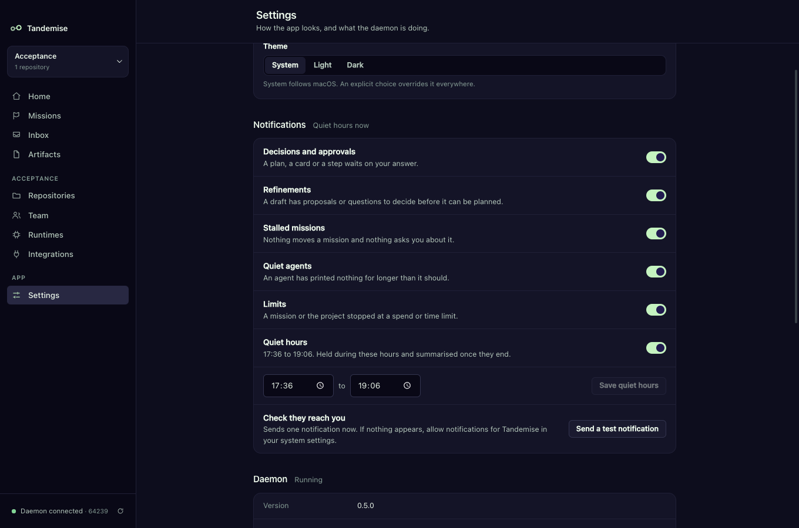
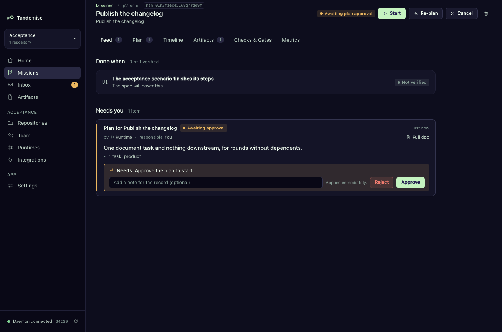

# Notifications: hear about it when something needs you

Your agents keep working when the Tandemise window is hidden or closed to the
tray. When something new lands in your Inbox and you are not already looking at
it, Tandemise shows one native notification. Click it and the window opens on
the thing to decide.

## What you get notified about

Only items that are in your Inbox, and only the ones that are for you. Each
kind has its own switch in **Settings → Notifications**:

| Switch | You hear about it when… | The notification says | Clicking opens |
|---|---|---|---|
| Decisions and approvals | a plan, a card or a step waits on your answer | "Decision needed" or "Your step is waiting" | the mission |
| Refinements | a draft has proposals or questions to decide before it can be planned | "Decide before planning" | the mission |
| Stalled missions | nothing moves a mission and nothing asks you about it | "Mission stalled" | Inbox, stalled only |
| Quiet agents | an agent has printed nothing for longer than it should | "Agent gone quiet" | the Inbox |
| Limits | a mission or the project stopped at a spend or time limit | "Limit reached" | the mission (or the Inbox) |

Check cards (a look at finished work that holds nothing up) never notify.

## Never a flood, never twice

- **Each Inbox item is announced once.** Tandemise remembers what it has told
  you, even across restarts. An item that leaves the Inbox and comes back is not
  announced again.
- **Several at once become one.** If three things arrive together you get one
  notification, "3 things need you", which opens the Inbox.
- **Nothing while you are looking.** If the window is in front and showing the
  Inbox, new items are simply there; you are not notified about them later
  either.
- **A switch that is off stays quiet about the past.** Turning a kind back on
  does not replay what arrived while it was off.

## Quiet hours

Turn on **Quiet hours** and set **From** and **To** (they can wrap midnight,
like 22:00 to 07:00), then **Save quiet hours**. While they are on, nothing is
shown; what arrives is held. When they end you get one notification, "After
quiet hours: N things need you", covering whatever is still waiting. Items you
dealt with in the meantime are left out. The section header reads **Quiet hours
now** while they are in force.

## Check that notifications reach you

Click **Send a test notification**. You should see "Notifications are on". If
nothing appears, allow notifications for Tandemise (or "Electron" when you run
it from source) in your system's notification settings.

## How it works

The daemon compares the Inbox with the list of items it has already announced,
and records the answer in its `settings.json` before replying, so the decision
never depends on the window being open. The desktop app asks every few seconds
and shows what comes back. Everything here is read from the Inbox's own rows;
no model decides what to tell you.
