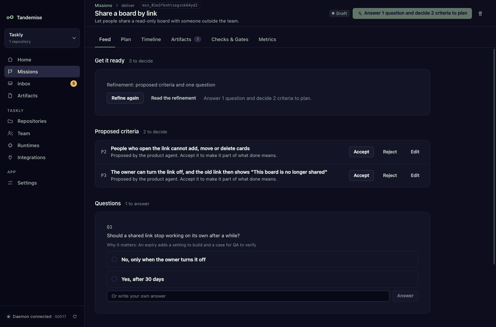

# Refine a rough request before it is planned

A one-line request is fine to start with. Before Tandemise plans it, a product
agent reads the request and the repository, proposes what "done" should mean,
and asks only the questions whose answers change the plan. You decide; the
mission cannot be planned until you have.



## How do I refine a request?

1. **New mission**: write the outcome and leave **Done when** empty. The button
   reads **Create and refine**. The mission is created as a draft and opens on
   **Get it ready**.
2. Press **Refine**. It runs in the background (the button reads "Refining…").
   The agent comes back with up to 8 proposed criteria and up to 5 questions.
3. Decide each proposal: **Accept**, **Reject**, or **Edit** and then
   **Accept with changes**. An accepted proposal becomes your next Done-when
   line (`U1`, `U2`, …), exactly as if you had typed it.
4. Answer each question: pick one of its options or write your own answer and
   press **Answer**.
5. Press **Plan** in the header.

You can also add a line yourself at any time with **Add a criterion**.

## Why is the Plan button disabled?

A draft is ready to plan only when all three are true:

- at least one Done-when line is accepted,
- no question is waiting for an answer,
- no proposal is waiting for a decision.

The Plan button says what is missing, for example "Answer 1 question and decide
2 criteria to plan" or "Add at least one Done-when criterion to plan". The
daemon checks the same rule, so planning through the API is refused in the same
way:

```
ready_to_plan := ready.criteria >= 1 && ready.open_questions == 0 && ready.proposed_pending == 0
```

A mission created with at least one Done-when line is ready at once.

## Where do I see drafts that need me?

The **Inbox** shows one row per draft with something to decide, for example
"Refinement: 3 to decide". It opens the mission and disappears once everything
is decided. Home's **Needs you** card counts it.

## What happens to my answers?

The planner receives your accepted criteria and your answers. Every role's
prompt also lists the answers under "Decided before planning", so a reviewer or
tester sees the same decisions the planner did. Rejected and replaced proposals
are never shown to any agent.

## Can I refine again?

Yes, while the mission is a draft. **Refine again** replaces every proposal you
have not decided and every question you have not answered (they are shown
dimmed as "Replaced by a newer proposal"). What you already decided stays
decided. Refinement is one pass at a time; it is not a conversation.

Once a mission has been planned, refining, answering and adding criteria are
refused: those are draft activities.

## What if the mission is autonomous?

A mission with autonomy **Autonomous** accepts proposed criteria automatically
("Accepted automatically"). It never answers questions for you, so an open
question still blocks planning.

## What if refinement fails?

The draft stays a draft with a plain reason (no runtime for the product role,
the run failed, or the output was invalid twice). You can press **Refine**
again, or add Done-when lines by hand and plan.
