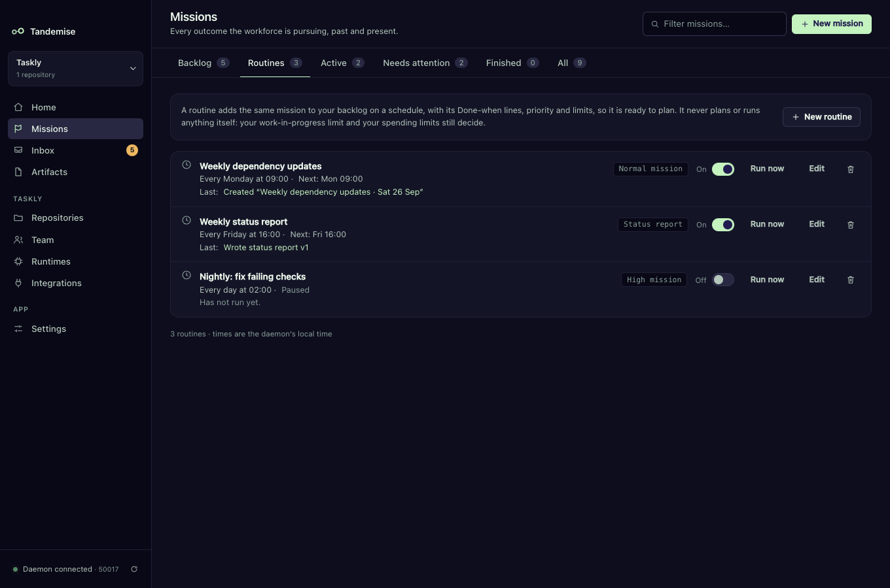
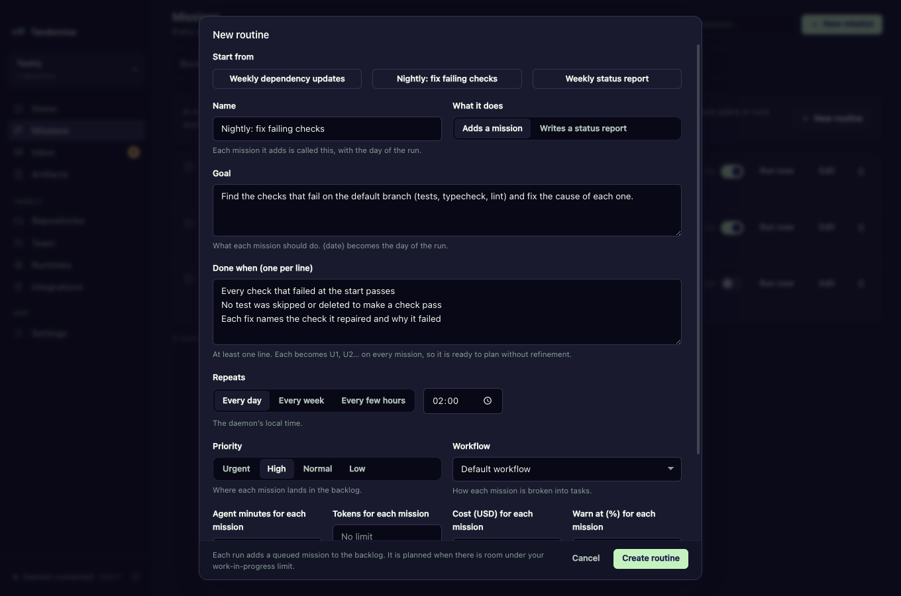

# Routines: standing work on a schedule

Some work is a habit, not a request: update the dependencies every week, fix
failing checks every night, write a status report every Friday. Describe it
once as a routine and Tandemise adds it to your backlog on schedule, with the
same Done-when lines, priority and limits every time.

A routine only ever adds a queued draft to the backlog. It never plans or runs
anything itself: your [work-in-progress limit](backlog.md), the
[readiness rule](refine.md) and your [spending limits](limits.md) decide when it
runs, exactly as for a mission you typed.

## How do I create one?

**Missions → Routines → New routine**. Start from a template, then change what
you like:

| Template | Does |
|---|---|
| **Weekly dependency updates** | every Monday at 09:00, a Normal mission to bring dependencies up to date |
| **Nightly: fix failing checks** | every day at 02:00, a High mission to get the checks green |
| **Weekly status report** | every Friday at 16:00, writes the project's [status report](desk-and-status-report.md) |

The fields:

- **Name**: also the start of every mission title it creates, followed by the
  day of the run ("Weekly dependency updates · Mon 28 Sep").
- **What it does**: **Adds a mission** or **Writes a status report**.
- **Goal**: what each mission should do. `{date}` becomes the date of the run.
- **Done when (one per line)**: required for a mission routine. Each line
  becomes `U1`, `U2`, … on every mission it creates, so each one is ready to
  plan without refinement.
- **Repeats**: **Every day** at a time, **Every week** on a day at a time, or
  **Every few hours** (every 1, 2, 3, 4, 6, 8 or 12 hours). Times are the
  daemon's local time.
- **Priority**, **Workflow**, and limits for each mission.

After you save, the row shows the schedule ("Every Monday at 09:00") and the
next run ("Next: Mon 09:00").

## What happens when it is due?

On schedule, the routine adds a queued draft to the Backlog with its Done-when
lines, priority, limits and workflow. The mission's header says "From routine:
<name>". From there the backlog picks it up like any other ready mission.

A run is **skipped**, and the row's "Last" line says why, when:

- **The previous mission from this routine is not finished**, including one
  still waiting in the backlog: "Skipped: previous run still active". A routine
  never piles up copies of the same work. Deleting the queued draft lets the
  next run go ahead.
- **The project is at its monthly limit**: "Skipped: Monthly limit reached: …".
  Over the warning level it still adds its mission; the backlog then holds it
  unless it is Urgent or High.

A status report routine is never skipped for either reason: it runs no agent and
spends nothing.

## What if Tandemise was not running?

When the daemon starts again, a routine that missed several runs runs **once**
to catch up and notes the rest: "Missed 3 runs while Tandemise was not running
(Mon 09:00 to Wed 09:00); ran once to catch up." The catch-up run is still
subject to the checks above.

## How do I pause, run or change one?

On each row:

- **On/Off** switch: a routine that is off never runs and shows "Paused".
  Turning it back on schedules the next run from now; the time it was off is
  not caught up.
- **Run now**: runs it once, immediately, with the same checks. The next
  scheduled run does not move.
- **Edit**: changing the schedule also schedules from now.
- **Delete** (asks first): missions it already created stay.

The "Last" line links to what the last run made: the mission it created, or the
report it wrote.
