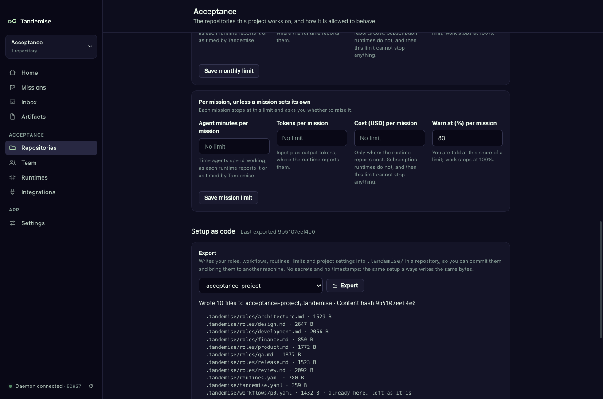
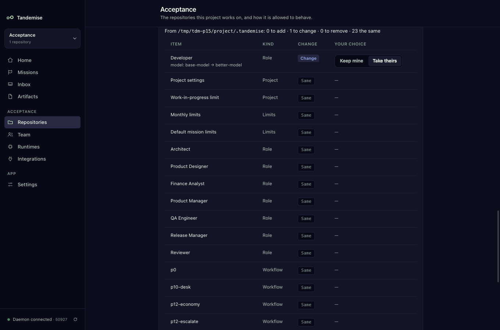
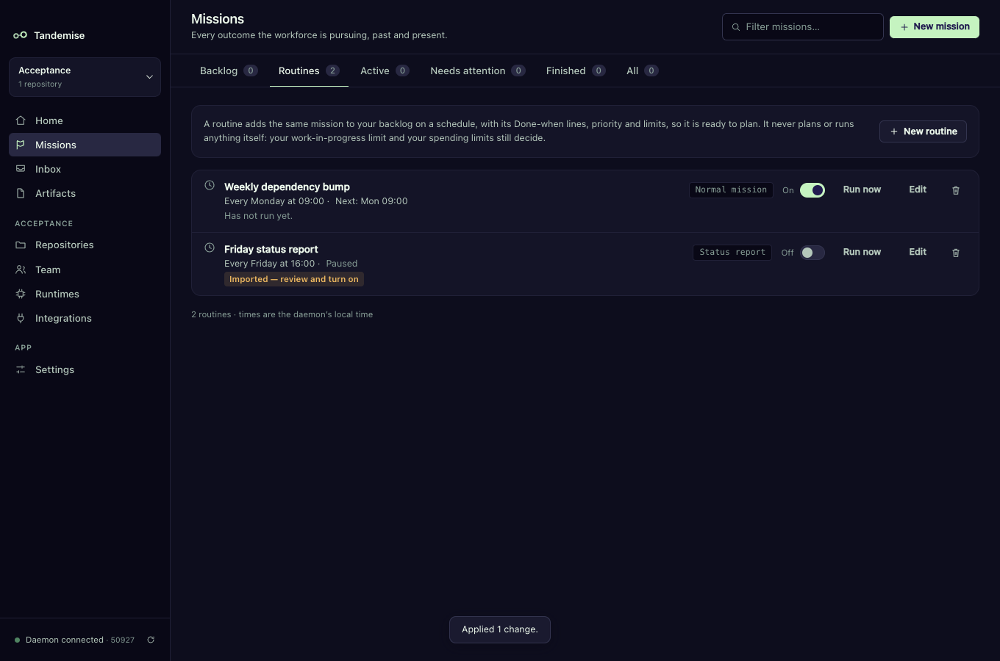
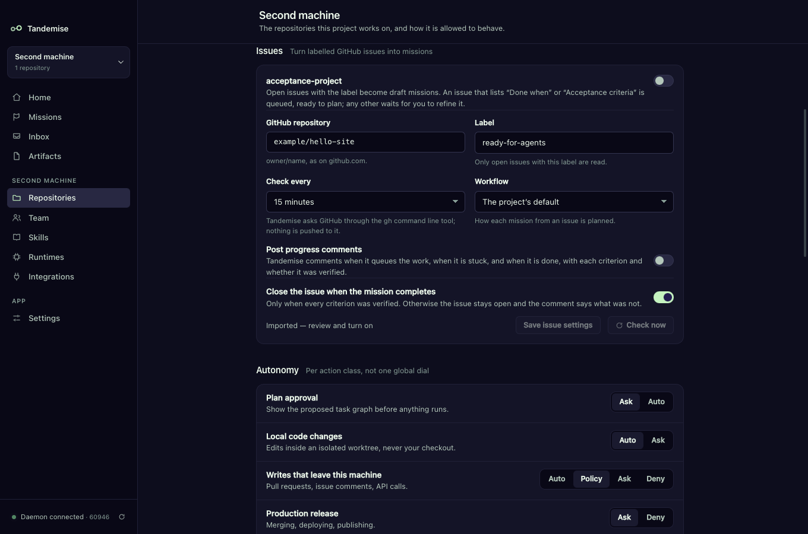
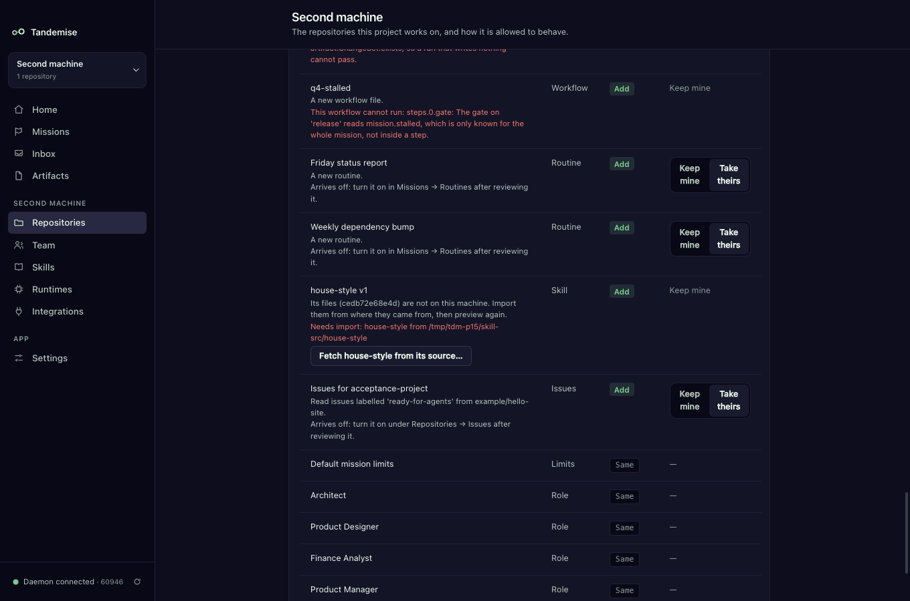
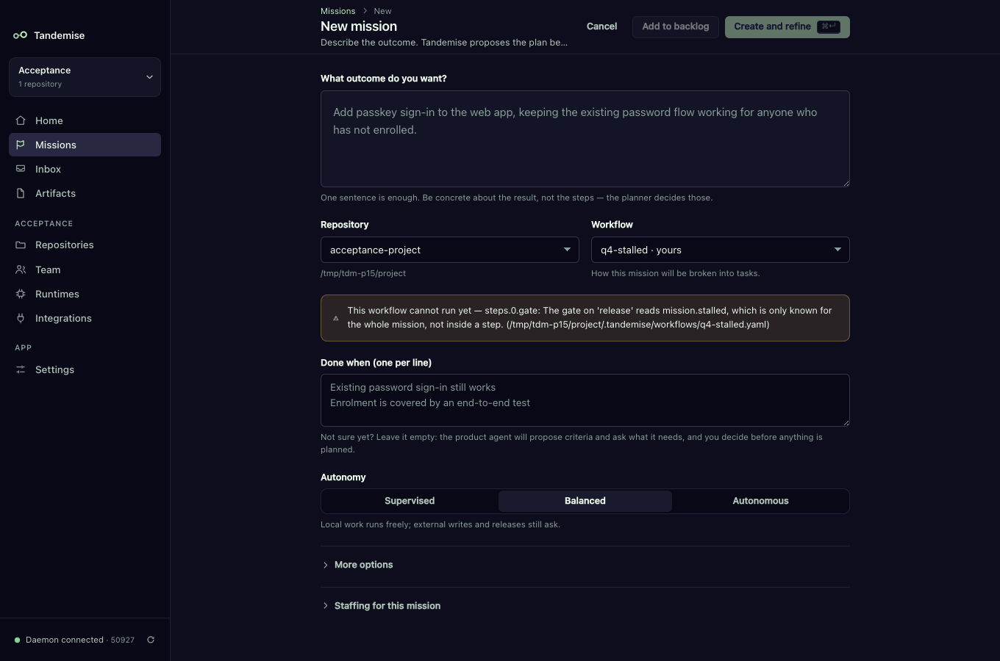

# Your setup as code

Your roles, their models and skill pins, your workflows, your routines, your
limits, your GitHub issue settings and your project settings can live in your
repository, next to the code they describe.
Commit them, bring them to another machine, and see every change in a diff.

Everything happens in **Project → Setup as code**.

## How do I put my setup in the repository?

1. Open **Project** in the sidebar and scroll to **Setup as code**.
2. Pick the repository under **Export to repository** and press **Export**.
3. Tandemise writes a `.tandemise/` folder in that repository and lists every
   file it wrote, with a **content hash**. The section's header then says
   **Last exported &lt;hash&gt;**.
4. Commit the folder like any other change.



What is written:

| File | What it holds |
|---|---|
| `.tandemise/tandemise.yaml` | `version`, the project's name, autonomy, workers and knowledge, the **work-in-progress limit** (`wipLimit`), the **monthly limits** (`limits.monthly`) and the **per-mission defaults** (`defaults.missionLimits`) |
| `.tandemise/roles/<id>.md` | one file per role (built-in ones too): its settings and **models** (`model`, `escalate`, `economyModel`) in the front matter, its instructions below |
| `.tandemise/workflows/*.yaml` | your workflow files. One that already lives in this repository is left exactly as it is; one from another repository of the project is copied |
| `.tandemise/routines.yaml` | your routines: goal, Done-when lines, priority, limits, workflow and schedule |
| `.tandemise/skills.lock` | only when the project has [skills](skills.md): each skill's newest version and every version a role pins, as name, version, content hash and source (the folder or git repository it was imported from). Never the skill's files |
| `.tandemise/issues.yaml` | only when a repository has [GitHub issue](github-issues.md) settings: per repository (by name) the GitHub repository, label, check interval, whether to close issues and post comments, the workflow, and whether it was on |

A role file looks like this:

```markdown
---
capabilities:
  - artifact.write
  - filesystem.write
  - repository.read
economyModel: my-cheap-model
escalate:
  - my-strong-model
id: development
isolation: worktree
model: my-model
name: Developer
…
runtime:
  - Claude Code
skills:
  - hash: 3f7a…(64 hex digits)
    name: house-style
    version: 1
---

You implement the plan …
```

## What is never written

- **Secrets.** Anything that looks like a token or a password in a role's
  instructions, your knowledge notes or a routine's goal is replaced with
  `${SECRET_1}`, `${SECRET_2}`, … and listed under `secrets:` in
  `tandemise.yaml`. Put the value back by hand after importing (or keep it out
  of the repository altogether).
- **Anything machine-specific.** Runtimes appear by name only (`runtime:` in a
  role file, for the reader); no paths, ids or people.
- **Timestamps.** The same setup always writes the same bytes and the same
  hash, so a diff shows only what you changed.
- **Skill files.** `skills.lock` says which files a pin means (by hash) and
  where they came from; the files themselves stay in your skills library.
- **Anything a check left behind.** `issues.yaml` holds settings only: never
  when issues were last read, an error, who switched it on, or the comments
  Tandemise wrote.

## How do I bring a setup into a project?

1. **Project → Setup as code → Import from a folder…** and choose the
   repository (or its `.tandemise` folder).
2. You see a preview, one row per item: **Add**, **Change**, **Remove** or
   **Same**, with what differs ("model: my-model → my-strong-model").
3. For every row that differs choose **Keep mine** or **Take theirs**. Adds and
   changes take theirs by default; removals keep yours.
4. Press **Apply**. Nothing changes before that, and Apply changes everything
   you chose or nothing at all.



To change a role's model from the files: edit `model:` in
`.tandemise/roles/<id>.md`, import from the repository, and apply the one
Change. Team → Roles shows the new model.

If the files change between the preview and Apply, Apply is refused ("The
files changed since the preview. Preview again.").

## Imported routines arrive off

An import never starts work. Every routine it adds or changes is saved **off**
and marked **Imported — review and turn on** in Missions → Routines. Turn it on
when you have read it.



## Imported GitHub issue settings arrive off

The same rule holds for [GitHub issues](github-issues.md): settings for a
repository are imported onto the repository **of the same name** in this
project, always **off**, and its Issues card says **Imported — review and turn
on**. Nothing is read from GitHub until you switch **Turn labelled issues into
missions** on. A repository the project does not have cannot be taken; the row
says to add it first.



## How do skill pins come across?

A role file keeps its pins with each skill's **content hash**, and
`skills.lock` says where each skill came from. On import, what matters is the
hash, not the version number (another library may number the same files
differently):

- **Already in this project's library** — the skill's row is **Same**, and the
  role is pinned to the library's version with those files.
- **On this machine, but not in this project** (another project imported the
  same files) — an **Add**: taking it adds the files to the library.
- **Not on this machine at all** — the row says **Needs import: &lt;name&gt; from
  &lt;source&gt;** and can never be taken, and neither can a role that pins it: its
  runs would refuse to start. Press **Fetch &lt;name&gt; from its source…** to see
  the same preview the Skills screen shows (files and SKILL.md), then **Import
  &lt;name&gt;**. The folder is read again, the skill row turns **Same**, and the
  role can be applied.



If the source now has different files from the ones pinned, the fetch says so
and does not import them: ask for the files the setup was exported with, or
change the pin.

## Gates that can never pass are refused

Tandemise checks every gate when it is written — a workflow file when it is
loaded, a planner's plan, an import — and refuses one that could never pass,
with a reason you can act on. In New mission the workflow shows:



The reasons:

- "The gate on 'release' reads mission.stalled, which is only known for the
  whole mission, not inside a step." — the fact exists, but only the daemon's
  own rules read it.
- "The gate on 'build' never checks that the step wrote its output: add
  artifact.ChangeSet.exists, so a run that writes nothing cannot pass."
- "The gate on 'build' reads checks.test, which Tandemise never measures. Did
  you mean checks.tests?"

Which facts a step's gate can read is listed in
[WORKFLOWS.md](../WORKFLOWS.md#gate-facts).

## Git and the `.tandemise` folder

Earlier versions told git to ignore the whole `.tandemise/` folder, which also
hid your workflow files from `git add`. Now only Tandemise's own working files
(`.tandemise/out/`) are ignored. An export repairs Tandemise's old ignore lines
in the chosen repository and tells you if a rule of your own still hides the
files, and how to fix it.

## Not yet

- A skill is never removed by an import, and a pin to a version the library
  no longer has is left out of the export.
- Staffing (which agent does which role) and runtime profiles stay on each
  machine; set them in Team and Runtimes.
