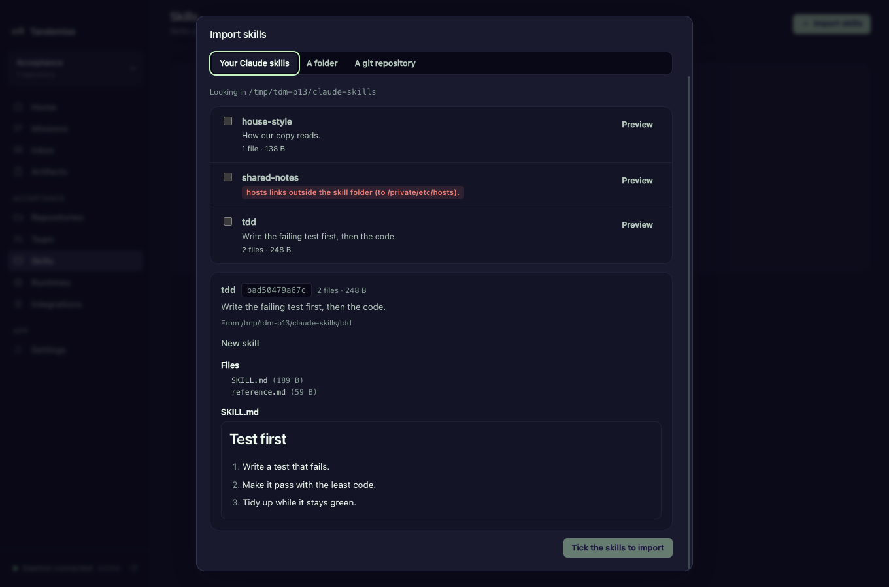
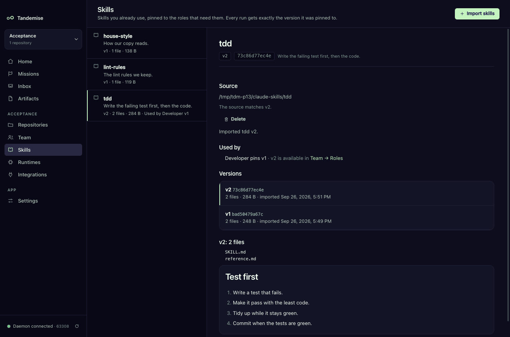
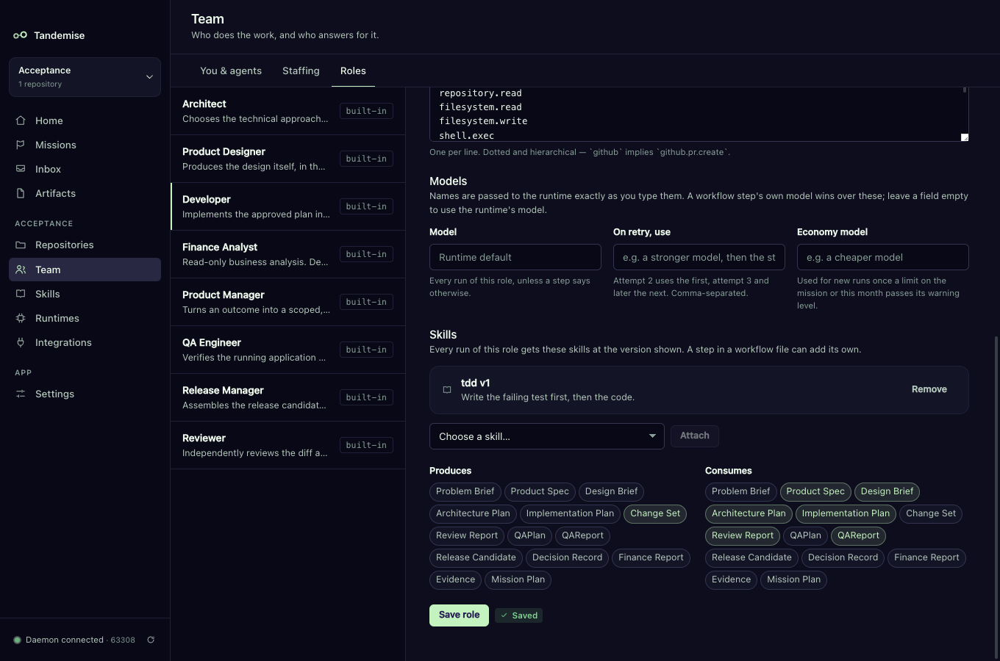
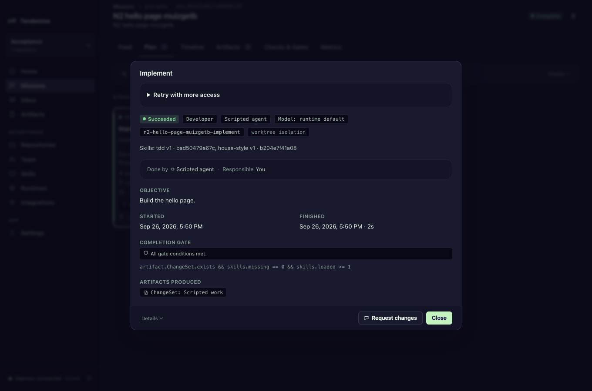

# Giving your agents your skills

You probably already have skills: folders with a `SKILL.md` that teach an agent
how you like tests written, how your copy reads, how a release is cut. Tandemise
can give them to your agents — only the ones you pick, only the roles that need
them, and always at the exact version you pinned. Editing a skill never changes
how work is done until you choose to take the new version.

Your agents never load your own global skills (`~/.claude/skills`) by
themselves. A skill reaches a run only when you import it and pin it here.

## How do I import my skills?

Open **Skills** in the sidebar (or ⌘K → Skills) and click **Import skills**.

| Tab | Imports from |
|---|---|
| **Your Claude skills** | every folder in `~/.claude/skills`, with a box to tick for each |
| **A folder** | any folder on this machine that has a `SKILL.md` at its top |
| **A git repository** | a repository URL (https://, ssh://, git@host:) and, if the skill is not at its top, the subfolder it is in |

Click **Preview** first. You see the skill's name and description (from its
`SKILL.md` front matter), every file in it, and the `SKILL.md` itself — before
anything is imported. The import then stores exactly what you previewed.



What Tandemise refuses, and says why:

- a folder without a `SKILL.md` at its top;
- a skill over 5 MB, or with more than 500 files;
- a link that points outside the skill's folder;
- a name that can't be a folder name.

Nothing in a skill is ever run. Files are read as they are, and a repository is
cloned shallow with its hooks switched off, then removed again.

## What is a version?

Every import is kept as a numbered version (v1, v2, …) identified by a hash of
its files. Importing the same files again changes nothing ("Already in the
library as tdd v1"); importing changed files makes the next version. Versions
never change once imported.

The Skills screen shows each skill's versions, the files and `SKILL.md` of any
version, where it came from, and which roles use it.



## How do I give a skill to a role?

Team → Roles → pick a role → **Skills** → choose a skill in **Attach a skill** →
**Attach** → **Save role**. The role pins the newest version at that moment.
Every run of the role from then on gets that version.



A workflow step can add skills of its own, just for that step:

```yaml
steps:
  - key: implement
    role: development
    objective: Build the change.
    skills: [house-style@latest, tdd@2]
```

`name@2` pins version 2; `name@latest` (or just `name`) pins the newest version
**when the mission is planned** — a later import does not change a mission that
already exists. A step's pin wins over its role's pin of the same skill. A
workflow that names a skill or version your library doesn't have is refused
when it is planned, naming the step and the skill.

## What does a run get?

When a step starts, its pinned skills are put where its runtime reads them:

- **Claude Code** finds them in its working folder's `.claude/skills/<name>/`.
  They are added to the repository's `.git/info/exclude`, so they never end up
  in a commit. A repository's own `.claude/skills/<name>` is never overwritten:
  that skill is given in the prompt instead.
- **Runtimes that don't read skills** get each `SKILL.md` added to the end of
  their prompt under **Skills pinned to this step**.

Each run records every skill it got — name, version and hash. The step's drawer
shows it: "Skills: tdd v1 · bad50479a67c, house-style v1 · b204e7f41a08"
("(in prompt)" when it went into the prompt).



## My skill changed. How do I take the new version?

When a skill's source folder no longer matches its newest version, the Skills
screen says **Update available**. Nothing is updated by itself:

1. Click the skill, then **Update**. The new files become the next version.
2. Roles keep the version they pinned. In Team → Roles the role offers
   **Use v2**; click it and **Save role**.

Missions planned before that keep the version they were planned with, and
finished runs keep showing the hash they ran with. A skill imported from a git
repository is checked only when you click **Update from source**.

## What if a pinned skill is missing?

If a step pins a skill whose files are no longer in the library (you deleted
the skill, say), the step does not start. It stops with the skill named —
"Skill 'lint-rules' v1 (a8d6b6cfe985) is missing from the skills library" — and
the Inbox asks you: import it again, then choose **Retry**. Importing the same
files brings back the same version.

You can't delete a skill a role still pins; detach it in Team → Roles first.

## Checking skills in a gate

Two facts are measured for every step, so a gate can require its skills:

| Fact | Meaning |
|---|---|
| `skills.loaded` | how many pinned skills the step's newest run got |
| `skills.missing` | how many of its pinned skills that run did not get at the pinned version |

```yaml
    gate: artifact.ChangeSet.exists && skills.missing == 0
```

## For tests and other runtimes

- `TANDEMISE_SKILLS_DISCOVER_DIR` changes where **Your Claude skills** looks
  (the default is `~/.claude/skills`).
- A generic CLI runtime that reads `.claude/skills` in its working folder can
  say so with `"skillsFolder": true` in its settings; otherwise its skills go
  into the prompt.
